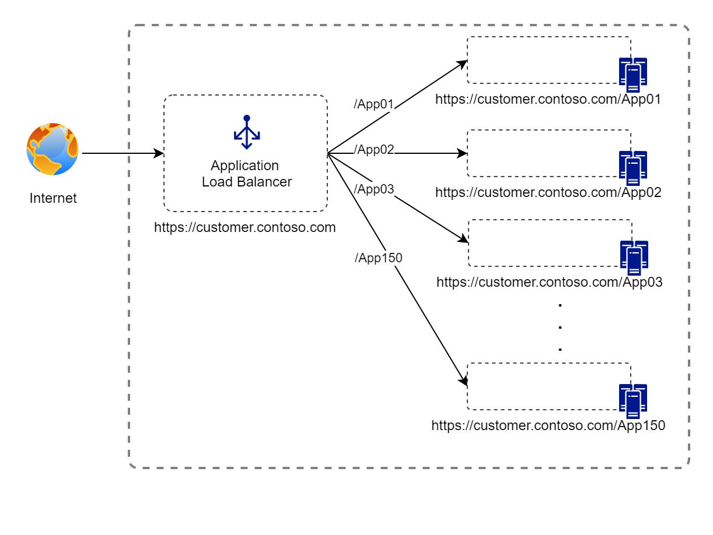
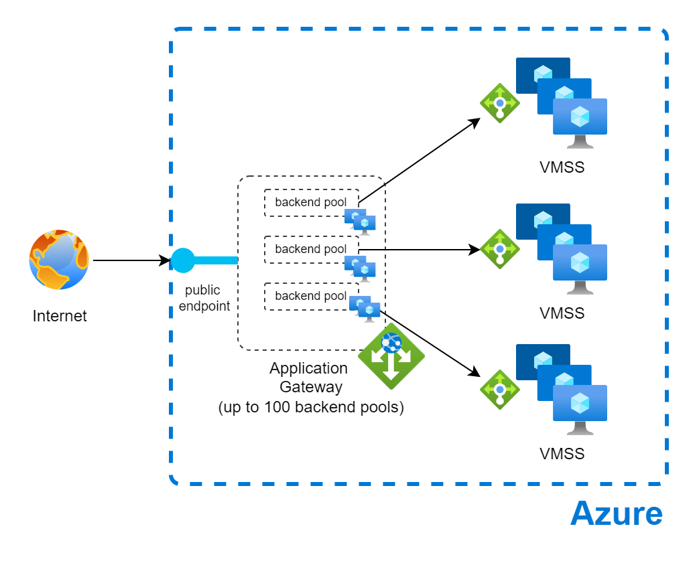
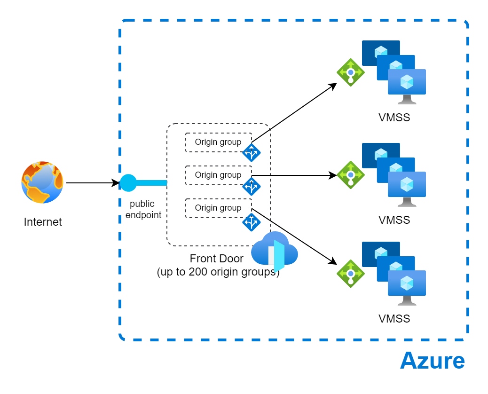
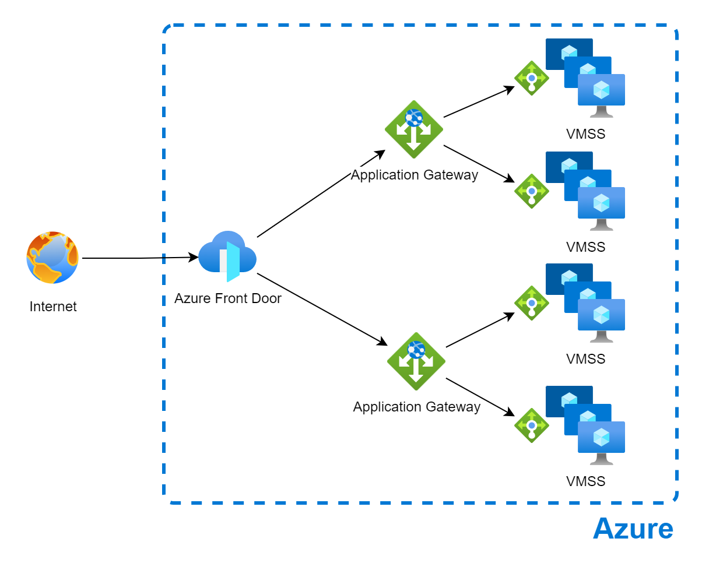
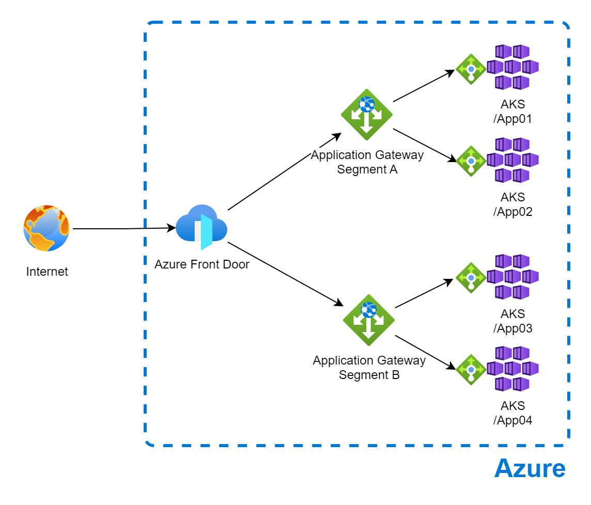

# Bypass limit of route paths of Front Door / Application Gateway

 
 
[](https://azure.microsoft.com)


This lab intends to help to handle the limit of routing paths of 200 origins of Front Door and / or 100 backends of Application Gateway, for very large deployments / migrations where all applications is under a unique URL and distributed by paths.

## Context
In large customers sometimes applications is distribuited under subdomains, and sometimes, under a unique subdomain they have more than 200 applications under different paths.


[Application Gateway path-based routing](https://learn.microsoft.com/en-us/azure/application-gateway/create-url-route-portal) can be used to route requests based on paths to different backend pools, but it have a [limit of 100 backend pools](https://learn.microsoft.com/en-us/azure/azure-resource-manager/management/azure-subscription-service-limits#azure-application-gateway-limits) for a single instance.



[Azure Front Door Routing feature](https://learn.microsoft.com/en-us/azure/frontdoor/front-door-routing-architecture?pivots=front-door-standard-premium) also can be used to route requests based on [matching of paths](https://learn.microsoft.com/en-us/azure/frontdoor/front-door-route-matching?pivots=front-door-standard-premium) to different origins groups, but it have a [limit of 200 origin groups per profile](https://learn.microsoft.com/en-us/azure/azure-resource-manager/management/azure-subscription-service-limits#azure-front-door-standard-and-premium-service-limits) (in Premium tier)


## Architecture diagram

The proposed solution for this scenario is to have a combination of Azure Front Door with Application Gateways in sequence. With this architecture, we increase the capability of path up to 20,000 applications paths (200 origin groups x 100 backend pools)



For lab proposes, in this sample it will use AKS for backend applications (under paths /App01, /App02, /App03 and /App04), distributed in a 2 Application Segments (A and B), under an Azure Front Door.

|Application Segment | Application|
|------- | -----------|
|Segment A | /App01|
|| /App02|
|Segment B | /App03|
|| /App04|


## Prerequisites
- An Azure account with an active subscription. [Create an account for free](https://azure.microsoft.com/free/?WT.mc_id=A261C142F).

---

## Configure Resource Group

Set up the virtual networking for the environment

```bash
az group create \
    --name fd-appg-pahtlimit \
    --location brazilsouth
```

#### Create Cluster 01

```bash
# Create AKS 01
az aks create --resource-group fd-appg-pahtlimit --name aks01 --enable-app-routing --enable-managed-identity --node-count 1 --generate-ssh-keys

#credentials
az aks get-credentials -n aks01 -g fd-appg-pahtlimit

#namespace
kubectl create namespace aks-app

#Deployment
kubectl apply -f https://raw.githubusercontent.com/marcosoikawa/frontdoor-app-gateway-path-limit/refs/heads/main/deployments/aks01.yaml -n aks-app

#service
kubectl apply -f https://raw.githubusercontent.com/marcosoikawa/frontdoor-app-gateway-path-limit/refs/heads/main/deployments/service.yaml -n aks-app

#ingress
kubectl apply -f https://raw.githubusercontent.com/marcosoikawa/frontdoor-app-gateway-path-limit/refs/heads/main/deployments/ingress01.yaml -n aks-app

#verify
kubectl get ingress -n aks-app

```
#### Create Cluster 02

```bash
# Create AKS 02
az aks create --resource-group fd-appg-pahtlimit --name aks02 --enable-app-routing --enable-managed-identity --node-count 1 --generate-ssh-keys

#credentials
az aks get-credentials -n aks02 -g fd-appg-pahtlimit

#namespace
kubectl create namespace aks-app

#Deployment
kubectl apply -f https://raw.githubusercontent.com/marcosoikawa/frontdoor-app-gateway-path-limit/refs/heads/main/deployments/aks02.yaml -n aks-app

#service
kubectl apply -f https://raw.githubusercontent.com/marcosoikawa/frontdoor-app-gateway-path-limit/refs/heads/main/deployments/service.yaml -n aks-app

#ingress
kubectl apply -f https://raw.githubusercontent.com/marcosoikawa/frontdoor-app-gateway-path-limit/refs/heads/main/deployments/ingress02.yaml -n aks-app

#verify
kubectl get ingress -n aks-app

```

#### Create Application Gateways

```bash

#create vnet
az network vnet create --name pathlimit-vnet --resource-group fd-appg-pahtlimit --location brazilsouth --address-prefix 10.22.0.0/16 --subnet-name appgtwsubnet --subnet-prefix 10.22.0.0/24

#create nsg with app gateway rules
####

#create public ip Gateway Segment A
az network public-ip create --resource-group fd-appg-pahtlimit --name appgtw-a-pip --allocation-method Static --sku Standard

#create public ip Gateway Segment B
az network public-ip create --resource-group fd-appg-pahtlimit --name appgtw-b-pip --allocation-method Static --sku Standard

#create Application Gateway Segment A
az network application-gateway create --name appgtw-A --location brazilsouth --resource-group fd-appg-pahtlimit --capacity 2 --sku Standard_v2 --public-ip-address appgtw-a-pip --vnet-name pathlimit-vnet --subnet appgtwsubnet --priority 100

#create Application Gateway Segment B
az network application-gateway create --name appgtw-B --location brazilsouth --resource-group fd-appg-pahtlimit --capacity 2 --sku Standard_v2 --public-ip-address appgtw-b-pip --vnet-name pathlimit-vnet --subnet appgtwsubnet --priority 100


```

#### Creating backend pools for Application Gateways
```bash


#AKS01
az aks get-credentials -n aks01 -g fd-appg-pahtlimit

ADDRESS=$(kubectl get ingress -n aks-app -o jsonpath='{.items[0].status.loadBalancer.ingress[0].ip}')

az network application-gateway address-pool create -g fd-appg-pahtlimit --gateway-name appgtw-A -n App01 --servers $ADDRESS


#AKS02
az aks get-credentials -n aks02 -g fd-appg-pahtlimit

ADDRESS=$(kubectl get ingress -n aks-app -o jsonpath='{.items[0].status.loadBalancer.ingress[0].ip}')

az network application-gateway address-pool create -g fd-appg-pahtlimit --gateway-name appgtw-A -n App02 --servers $ADDRESS


#create health probe Application Gateway Segment A
az network application-gateway probe create -g fd-appg-pahtlimit --gateway-name appgtw-A -n urlProbe --protocol http --host aks.oikawa.dev.br --path "/"


#create health probe Application Gateway Segment B
az network application-gateway probe create -g fd-appg-pahtlimit --gateway-name appgtw-A -n urlProbe --protocol http --host aks.oikawa.dev.br --path "/"

```

#### Creating Front Door
```bash
az afd profile create --profile-name pathlimit --resource-group fd-appg-pahtlimit --sku Standard_AzureFrontDoor

az afd endpoint create --resource-group fd-appg-pahtlimit --endpoint-name pathlimit --profile-name pathlimit --enabled-state Enabled

# Segment A Origin Group
az afd origin-group create --resource-group fd-appg-pahtlimit --origin-group-name SegmentA-og --profile-name pathlimit --probe-request-type GET --probe-protocol Http --probe-interval-in-seconds 60 --probe-path / --sample-size 4 --successful-samples-required 3 --additional-latency-in-milliseconds 50

# Segment B Origin Group
az afd origin-group create --resource-group fd-appg-pahtlimit --origin-group-name SegmentB-og --profile-name pathlimit --probe-request-type GET --probe-protocol Http --probe-interval-in-seconds 60 --probe-path / --sample-size 4 --successful-samples-required 3 --additional-latency-in-milliseconds 50

## via Portal

```
## Learn more
[Azure Front Door documentation](https://learn.microsoft.com/en-us/azure/frontdoor/)

[Application Gateway documentation](https://learn.microsoft.com/en-us/azure/application-gateway/overview)


## Contributors

*This article will be maintained by Microsoft. It was originally written by the following contributors.*

Principal authors:

- [Marcos Hirohsi Oikawa](https://www.linkedin.com/in/marcos-hiroshi-oikawa) | Technical Specialist
- [Leandro Oliveira](https://www.linkedin.com/in/so-leandro/) | Technical Specialist
- [Augusto Wagner de Araujo](https://www.linkedin.com/in/augustowagner/) | Cloud Solution Architect
- [Igor de Aguiar](https://www.linkedin.com/in/igor-de-aguiar/) | Cloud Solution Architect

*To see non-public LinkedIn profiles, sign in to LinkedIn.*

## Contributing

This project welcomes contributions and suggestions.  Most contributions require you to agree to a
Contributor License Agreement (CLA) declaring that you have the right to, and actually do, grant us
the rights to use your contribution. For details, visit https://cla.opensource.microsoft.com.

When you submit a pull request, a CLA bot will automatically determine whether you need to provide
a CLA and decorate the PR appropriately (e.g., status check, comment). Simply follow the instructions
provided by the bot. You will only need to do this once across all repos using our CLA.

This project has adopted the [Microsoft Open Source Code of Conduct](https://opensource.microsoft.com/codeofconduct/).
For more information see the [Code of Conduct FAQ](https://opensource.microsoft.com/codeofconduct/faq/) or
contact [opencode@microsoft.com](mailto:opencode@microsoft.com) with any additional questions or comments.

## Trademarks

This project may contain trademarks or logos for projects, products, or services. Authorized use of Microsoft 
trademarks or logos is subject to and must follow 
[Microsoft's Trademark & Brand Guidelines](https://www.microsoft.com/en-us/legal/intellectualproperty/trademarks/usage/general).
Use of Microsoft trademarks or logos in modified versions of this project must not cause confusion or imply Microsoft sponsorship.
Any use of third-party trademarks or logos are subject to those third-party's policies.
