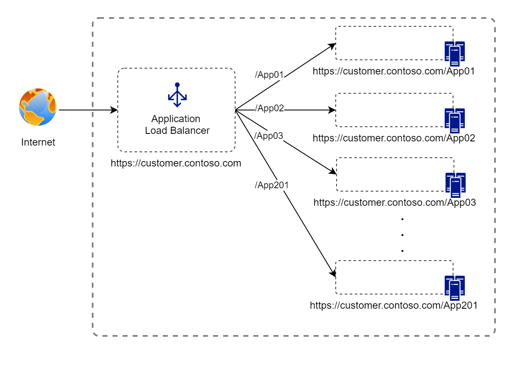

# Bypass limit of paths of Front Door / Application Gateway
This sample objective is to handle the limit of routing paths of 200 origins of Front Door and / or 100 backends of Application Gateway, for very large deployments / migrations where all applications is under a unique URL and distributed by paths

## Context
In large customers, sometimes applications is distribuited under subdomains, and sometimes, under a unique subdomain they have more than 200 applications under different paths.


[Application Gateway path-based routing](https://learn.microsoft.com/en-us/azure/application-gateway/create-url-route-portal) can be used to route requests based on paths to different backend pools, but it have a [limit of 100 backend pools](https://learn.microsoft.com/en-us/azure/azure-resource-manager/management/azure-subscription-service-limits#azure-application-gateway-limits) in a single instance.


[Azure Front Door Routing](https://learn.microsoft.com/en-us/azure/frontdoor/front-door-routing-architecture?pivots=front-door-standard-premium) can be used to route request based on [matching of paths](https://learn.microsoft.com/en-us/azure/frontdoor/front-door-route-matching?pivots=front-door-standard-premium), but it have a [limit of 200 origin groups per profile](https://learn.microsoft.com/en-us/azure/azure-resource-manager/management/azure-subscription-service-limits#azure-front-door-standard-and-premium-service-limits) (in Premium tier)


## Architecture diagram

The proposed solution for this scenario is to have a combination of Azure Front Door with Application Gateways in sequence. With this architecture, we increase the capability of path up to 20,000 applications paths.


## Prerequisites
- An Azure account with an active subscription. [Create an account for free](https://azure.microsoft.com/free/?WT.mc_id=A261C142F).

---

## Configure Resource Group

Set up the virtual networking for the environment

```bash
az group create \
    --name fd-appg-pahtlimit \
    --location brazilsouth
```

#### Create Cluster 01

```bash
# Create AKS 01
az aks create --resource-group fd-appg-pahtlimit --name aks01 --enable-app-routing --enable-managed-identity --node-count 1 --generate-ssh-keys

#credentials
az aks get-credentials -n aks01 -g fd-appg-pahtlimit

#namespace
kubectl create namespace aks-app

#Deployment
kubectl apply -f https://raw.githubusercontent.com/marcosoikawa/frontdoor-app-gateway-path-limit/refs/heads/main/deployments/aks01.yaml -n aks-app

#service
kubectl apply -f https://raw.githubusercontent.com/marcosoikawa/frontdoor-app-gateway-path-limit/refs/heads/main/deployments/service.yaml -n aks-app

#ingress
kubectl apply -f https://raw.githubusercontent.com/marcosoikawa/frontdoor-app-gateway-path-limit/refs/heads/main/deployments/ingress01.yaml -n aks-app

#verify
kubectl get ingress -n aks-app

```
#### Create Cluster 02

```bash
# Create AKS 02
az aks create --resource-group fd-appg-pahtlimit --name aks02 --enable-app-routing --enable-managed-identity --node-count 1 --generate-ssh-keys

#credentials
az aks get-credentials -n aks02 -g fd-appg-pahtlimit

#namespace
kubectl create namespace aks-app

#Deployment
kubectl apply -f https://raw.githubusercontent.com/marcosoikawa/frontdoor-app-gateway-path-limit/refs/heads/main/deployments/aks02.yaml -n aks-app

#service
kubectl apply -f https://raw.githubusercontent.com/marcosoikawa/frontdoor-app-gateway-path-limit/refs/heads/main/deployments/service.yaml -n aks-app

#ingress
kubectl apply -f https://raw.githubusercontent.com/marcosoikawa/frontdoor-app-gateway-path-limit/refs/heads/main/deployments/ingress02.yaml -n aks-app

#verify
kubectl get ingress -n aks-app

```

#### Create Application Gateways

```bash

#create vnet
az network vnet create --name pathlimit-vnet --resource-group fd-appg-pahtlimit --location brazilsouth --address-prefix 10.22.0.0/16 --subnet-name appgtwsubnet --subnet-prefix 10.22.0.0/24

#create nsg with app gateway rules
####

#create public ip Gateway Segment A
az network public-ip create --resource-group fd-appg-pahtlimit --name appgtw-a-pip --allocation-method Static --sku Standard

#create public ip Gateway Segment B
az network public-ip create --resource-group fd-appg-pahtlimit --name appgtw-b-pip --allocation-method Static --sku Standard

#create Application Gateway Segment A
az network application-gateway create --name appgtw-A --location brazilsouth --resource-group fd-appg-pahtlimit --capacity 2 --sku Standard_v2 --public-ip-address appgtw-a-pip --vnet-name pathlimit-vnet --subnet appgtwsubnet --priority 100

#create Application Gateway Segment B
az network application-gateway create --name appgtw-B --location brazilsouth --resource-group fd-appg-pahtlimit --capacity 2 --sku Standard_v2 --public-ip-address appgtw-b-pip --vnet-name pathlimit-vnet --subnet appgtwsubnet --priority 100


```

#### Creating backend pools for Application Gateways
```bash


#AKS01
az aks get-credentials -n aks01 -g fd-appg-pahtlimit

ADDRESS=$(kubectl get ingress -n aks-app -o jsonpath='{.items[0].status.loadBalancer.ingress[0].ip}')

az network application-gateway address-pool create -g fd-appg-pahtlimit --gateway-name appgtw-A -n App01 --servers $ADDRESS


#AKS02
az aks get-credentials -n aks02 -g fd-appg-pahtlimit

ADDRESS=$(kubectl get ingress -n aks-app -o jsonpath='{.items[0].status.loadBalancer.ingress[0].ip}')

az network application-gateway address-pool create -g fd-appg-pahtlimit --gateway-name appgtw-A -n App02 --servers $ADDRESS


#create health probe Application Gateway Segment A
az network application-gateway probe create -g fd-appg-pahtlimit --gateway-name appgtw-A -n urlProbe --protocol http --host aks.oikawa.dev.br --path "/"


#create health probe Application Gateway Segment B
az network application-gateway probe create -g fd-appg-pahtlimit --gateway-name appgtw-A -n urlProbe --protocol http --host aks.oikawa.dev.br --path "/"

```

#### Creating Front Door
```bash
az afd profile create --profile-name pathlimit --resource-group fd-appg-pahtlimit --sku Standard_AzureFrontDoor

az afd endpoint create --resource-group fd-appg-pahtlimit --endpoint-name pathlimit --profile-name pathlimit --enabled-state Enabled

# Segment A Origin Group
az afd origin-group create --resource-group fd-appg-pahtlimit --origin-group-name SegmentA-og --profile-name pathlimit --probe-request-type GET --probe-protocol Http --probe-interval-in-seconds 60 --probe-path / --sample-size 4 --successful-samples-required 3 --additional-latency-in-milliseconds 50

# Segment B Origin Group
az afd origin-group create --resource-group fd-appg-pahtlimit --origin-group-name SegmentB-og --profile-name pathlimit --probe-request-type GET --probe-protocol Http --probe-interval-in-seconds 60 --probe-path / --sample-size 4 --successful-samples-required 3 --additional-latency-in-milliseconds 50

## via Portal

```